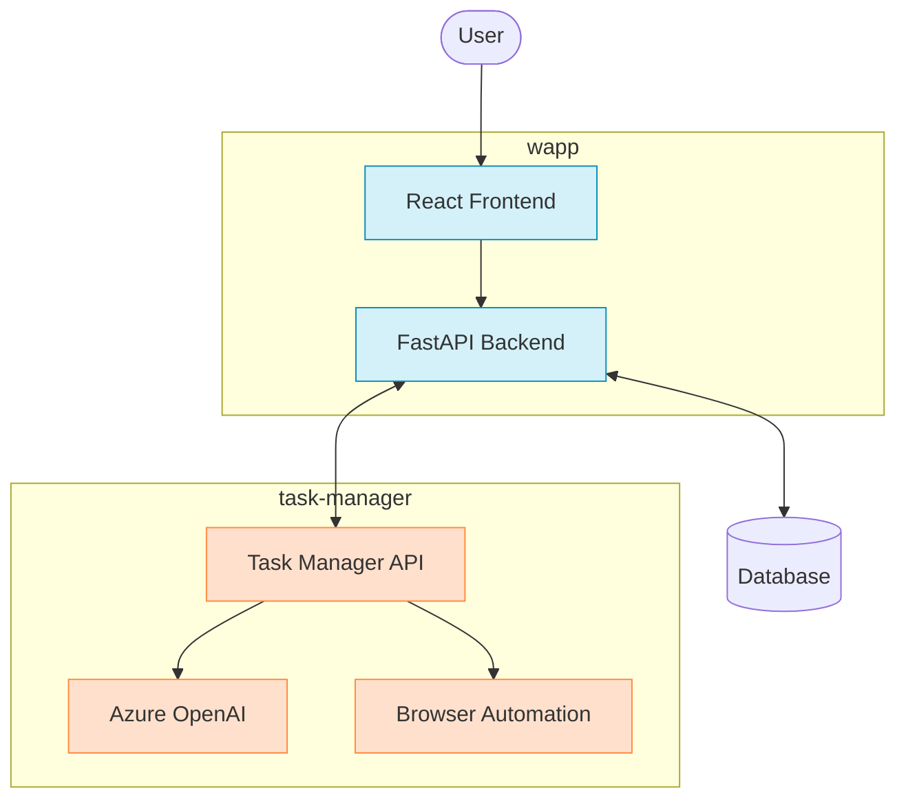

# Monorepo

This repository contains the internal projects and applications maintained by Laneo.

## Repository Structure

This monorepo is organized into the following key projects:

### 🐛 Bug Reporting and Management System (`wapp/`)

A comprehensive application for managing software testing, bug reporting, and team collaboration. The system helps software teams organize their products, track features, document user stories, define acceptance criteria, manage tests, and report bugs.

**Key Components:**
- FastAPI backend with comprehensive data models
- React frontend with modern component architecture
- Multi-tenant architecture with organization management
- Secure secrets management for test credentials
- Role-based access control

### 🤖 Task Manager (`task-manager/`)

A FastAPI server that generates automated tests based on acceptance criteria, utilizing Azure OpenAI for AI-powered test generation.

**Key Features:**
- Generate automated tests from acceptance criteria
- Browser automation for authentication
- Support for authentication fixture generation
- API endpoints for test generation

### 🌐 Landing Page (`landing/`)

React-based landing page application.

## System Architecture

The following diagram illustrates how the different components in our system communicate:



In this architecture:
- The React frontend in the `wapp/` directory provides the user interface
- The FastAPI backend handles business logic and data management
- The Task Manager service generates automated tests based on acceptance criteria using Azure OpenAI
- The Task Manager performs browser automation for authentication testing

## Development

### Setup

Each project has its own setup instructions in their respective README files. Please refer to those for project-specific setup instructions.

### Pre-commit Hooks

This repository uses pre-commit hooks to ensure code quality. The following hooks are configured:

- Code formatting and general checks
- Type checking with mypy
- Linting with flake8

Install the pre-commit hooks with:

```bash
pip install pre-commit
pre-commit install
```
